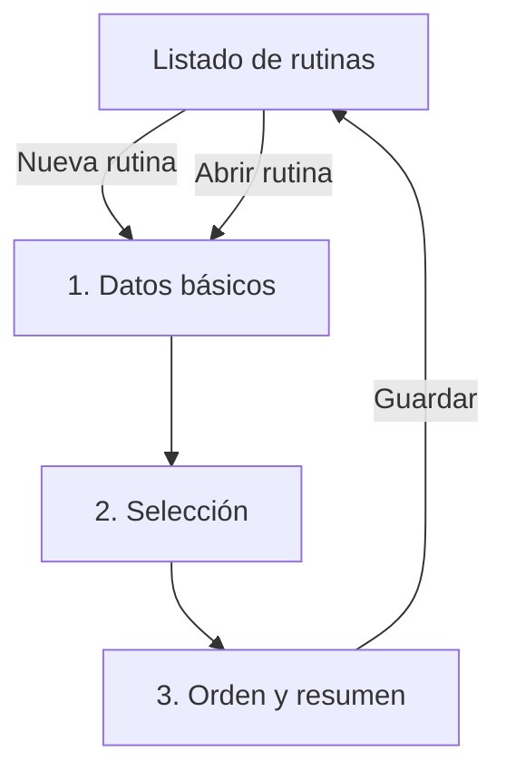

# GymUp — Flujo UX de rutinas v1

Estado: **implementado, pendiente de validación física**

Issue origen: #18

Fecha: 2026-08-30

## 1. Problema verificado

La versión anterior resolvía listado, alta y edición dentro de una sola `LazyColumn`. Al seleccionar una rutina, el editor aparecía después del listado y podía quedar fuera del viewport, por lo que la acción parecía no producir ningún resultado.

La misma columna acumulaba:

1. formulario de alta;
2. rutinas guardadas;
3. datos editables de la rutina;
4. ejercicios seleccionados;
5. catálogo completo disponible;
6. reordenación, borrado y mensajes.

## 2. Flujo objetivo

La navegación usa destinos independientes:

| Destino | Responsabilidad | Acción primaria visible |
|---|---|---|
| `routines` | Consultar rutinas | `Nueva rutina` |
| `routine/new` | Crear un borrador por pasos | `Siguiente` / `Guardar` |
| `routine/{routineId}` | Editar un borrador por pasos | `Siguiente` / `Guardar` |

## 3. Wireframe de baja fidelidad

| Pantalla | Zona superior | Zona de contenido acotada | Zona inferior persistente |
|---|---|---|---|
| Listado | Atrás + título | Lista desplazable o estado vacío | `Nueva rutina` flotante |
| Datos | Cancelar + título + pasos | Nombre, descripción y tipo sugerido | `Siguiente` |
| Selección | Cancelar + título + pasos | Búsqueda, filtro de grupo y resultados desplazables | `Anterior` + `Siguiente` |
| Resumen | Cancelar + título + pasos | Datos, orden y acciones `Subir`, `Bajar`, `Quitar` | `Anterior` + `Guardar` |

El scroll se conserva únicamente dentro de listas dinámicas o cuando la fuente ampliada lo requiera. La acción primaria no depende de alcanzar el final del contenido.

## 4. Decisiones de interacción

- La rutina se guarda de forma atómica al final; los cambios intermedios son un borrador de UI.
- El nombre es el único dato obligatorio, igual que en el comportamiento previo.
- Se permite una rutina sin ejercicios, igual que antes.
- El tipo sugerido y la descripción continúan siendo opcionales.
- El selector excluye ejercicios ya elegidos, busca en español e inglés y filtra por grupo muscular.
- Los favoritos aparecen primero; después se usa orden alfabético estable.
- Los ejercicios desactivados ya presentes siguen visibles y pueden conservarse, reordenarse o quitarse, pero no pueden añadirse de nuevo.
- La reordenación usa acciones con texto, no símbolos `↑/↓` aislados.
- El borrado informa de que las sesiones ya creadas no cambian.

## 5. Alineación arquitectónica

- `RoutineListViewModel` expone el estado inmutable del listado.
- `RoutineEditorViewModel` conserva el borrador y procesa eventos explícitos.
- `SaveRoutineUseCase` valida y coordina el guardado.
- `FilterRoutineExercisesUseCase` mantiene búsqueda y orden fuera de Compose.
- `RoutineRepository` y `RoomRoutineRepository` quedan separados de sesiones.
- `RoomRoutineRepository.saveRoutine` reemplaza metadatos y orden de ejercicios en una única transacción Room.

## 6. Validación requerida

En el dispositivo objetivo se deben completar estas tareas con el APK exacto de la PR:

1. crear una rutina con nombre, tipo y descripción;
2. buscar y filtrar ejercicios;
3. añadir varios ejercicios;
4. cambiar su orden con `Subir` y `Bajar`;
5. guardar y volver a abrir la rutina;
6. crear una sesión desde esa rutina;
7. repetir al menos la edición con tamaño de fuente ampliado;
8. comprobar que la acción primaria permanece localizable en cada paso.

La Issue #18 y la validación física del propietario son la fuente de verdad para aceptar definitivamente el flujo.
